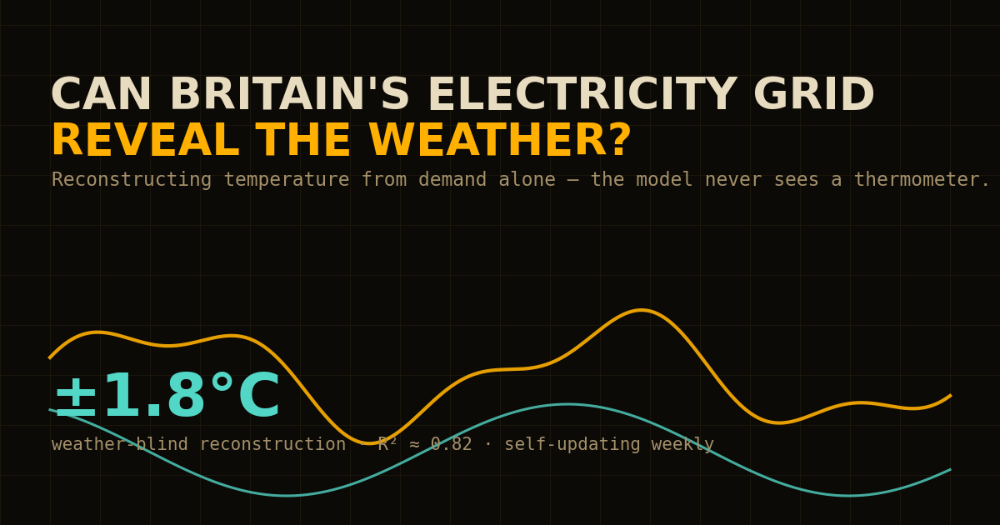

# Can Britain's Electricity Grid Reveal the Weather?

*Reconstructing Great Britain's daily temperature from electricity-demand behaviour alone — without ever showing the model a thermometer.*

[](https://github.com/elifslmz44/grid-weather/actions/workflows/refresh.yml)

**Live, self-updating site:** https://elifslmz44.github.io/grid-weather/ — rebuilt automatically every week from the latest public data.



---

## TL;DR

A **weather-blind** model reconstructs Britain's daily mean temperature to **≈±1.8 °C (R² ≈ 0.82)** on years it never trained on — about **18% better** than knowing only the calendar date. The point was never the score; it was the experiment, and what it reveals: the grid responds several times more sharply to cold than to heat, and electricity behaviour carries real temperature information *beyond* the season. Every number is validated chronologically, ships with an honest uncertainty band, and the whole pipeline re-runs itself weekly so nothing on the site goes stale.

> Headline figures below are from a representative run; the exact values refresh weekly on the live site. No metric here is hand-typed — each is produced by the evaluation pipeline in this repo.

## The question

Electricity demand responds to how people behave, and how people behave responds to the weather. This project treats the GB grid as an **indirect sensor**: if the observed temperature were hidden, how much could we infer about British weather from demand patterns alone? The model trains on grid-derived and calendar features with **temperature deliberately withheld** — only *after* it predicts do I join real weather to see how close it got, and, more interestingly, where and why it fails.

Two honest boundaries I set from the start:

- This **reconstructs the past**, it does not forecast future weather. A weather-blind model has no way to see a coming cold snap.
- Correlation between demand and temperature does **not** mean the grid "measures" weather. The framing throughout is "how much signal is recoverable", not "the grid is a thermometer".

## Data

| Layer | Source | Access | Granularity | Notes |
|---|---|---|---|---|
| Electricity | NESO **Historic Demand Data** (CKAN portal) | Open API, no key | Half-hourly (48 periods/day) | `ND`, `TSD`, embedded wind/solar. Published ~21 days in arrears; recent weeks provisional. |
| Weather | **Open-Meteo** Historical API (ERA5 reanalysis) | Open API, no key | Hourly | Population-weighted across 10 GB cities. |

**Weather substitution, documented deliberately.** The first-choice source was Met Office station observations, but those need credentials and give patchy long-run coverage, so this build uses ERA5 reanalysis via Open-Meteo. ERA5 blends station, satellite, aircraft and buoy data through a numerical model — it is *not* raw station data, and is tuned for consistency over pinpoint daily accuracy. The weather layer is isolated in `src/ingest_weather.py` so it can be swapped for Met Office DataHub later without touching the rest of the pipeline.

**National proxy.** Hourly 2 m temperature for 10 population centres (London, Birmingham, Manchester, Leeds, Glasgow, Sheffield, Bristol, Newcastle, Liverpool, Edinburgh) combined with population weights, so the national estimate leans toward where load actually is. **Study period:** 2015–2025 (configurable).

## Pipeline & engineering

This is the part I care most about — the analysis is only as trustworthy as the data plumbing under it.

```
   NESO CKAN API                         Open-Meteo ERA5 API
        │                                        │
        ▼                                        ▼
  Raw electricity CSVs                  Raw per-city temperature JSON
   (cached on disk)                         (cached on disk)
        └───────────────┬────────────────────────┘
                        ▼
          Cleaning · validation · timezone/DST alignment
                        ▼
               Weather-blind feature engineering
                        ▼
     climatology baseline → linear → random forest  (Model A vs B)
                        ▼
        Predicted temperature  ──►  join REAL weather (held out)
                        ▼
   Walk-forward CV · prediction intervals · SHAP · cold-spell · forecast
                        ▼
          Frozen JSON  ──►  self-contained static site
```

Details worth noting:

- **DST-aware cleaning.** British clocks change twice a year; naïve handling silently drops or duplicates an hour. The cleaner reconciles UTC and local time explicitly. Across 2015–2025 (~193k half-hours) the validated series has **0 missing intervals, 0 duplicates, 0 impossible values and 0 DST mismatches**, aggregated to ~4,000 clean daily rows.
- **Tests gate the pipeline.** `pytest` covers the timestamp/DST logic, deduplication and validation; the weekly job runs them *before* it publishes, so a bad change can't reach the live site.
- **Self-contained site.** The whole front end reads one bundled `docs/data.js` — no server, no database, works from `file://`, deploys as static files.
- **It updates itself.** A scheduled GitHub Action re-pulls both APIs, reruns the full analysis, runs the tests, and commits the refreshed results every week; GitHub Pages then republishes. The live figures are never a stale snapshot — that green badge above is the proof.

## Method

- **Weather-blind features only.** Temperature is never an input. **Model A** uses electricity/grid-derived features; **Model B** adds calendar context (month, daylight, holidays). The A/B split directly answers: *how much weather signal is in demand behaviour, versus simply knowing the time of year?*
- **Baselines first:** day-of-year climatology, then a regularised linear model, before any tree ensemble.
- **Chronological holdout.** Earlier years train, later years test. Order is never shuffled.
- **Walk-forward cross-validation.** The model is retrained for each held-out year (expanding window), so the headline number isn't a fluke of one split.
- **Prediction intervals.** A 90% band calibrated conformally on out-of-sample residuals — with the coverage it *actually* achieved reported honestly, not the coverage hoped for.
- **Explainability (SHAP)** for what the model leans on, globally and per day.

## What I found

On a strict chronological holdout (train 2015–2022, test 2023–2025), reconstructing daily mean temperature having never seen a thermometer:

| Model | Features | MAE (°C) | RMSE (°C) | R² |
|---|---|---|---|---|
| Climatology | day-of-year average only | 2.14 | 2.74 | 0.72 |
| Electricity only (RF) | demand behaviour, no calendar | 2.73 | 3.40 | 0.57 |
| **Electricity + calendar (RF)** | demand + month/daylight/holiday | **1.77** | **2.19** | **0.82** |

The nuance is the interesting bit. Electricity demand *alone* is a **worse** guide than just knowing the date — the seasonal cycle dominates. But demand *added to* the calendar beats climatology by **0.38 °C (≈18% lower error)**, so the grid genuinely carries temperature information beyond seasonality. SHAP and impurity importance agree on what does the work: the **7-day rolling mean of demand** and the **overnight minimum** — sustained load and baseline heating, exactly the heating-load fingerprint you'd hope a weather-blind model would latch onto rather than a spurious shortcut.

Three findings I'd point an interviewer to:

- **Heating/cooling asymmetry.** Demand climbs steeply as it gets colder, then flattens once it's mild — a kink, not a symmetric V. Britain heats electrically but rarely cools electrically, so the model reads cold snaps far more sharply than warm spells. (Quantified with a fitted breakpoint on the site.)
- **The grid is shrinking.** A long-term decline of roughly **−2.3%/year** (~−670 MW/yr) runs through the decade — efficiency, LED lighting, rooftop solar. The model has to avoid mistaking that slow drift for a change of season, which is why the trend is measured and removed.
- **It generalises.** Walk-forward validation keeps the error in a tight band across every held-out year rather than spiking — the result travels.

Cold-spell detection (precision/recall), the largest-error failure analysis, the walk-forward spread, and the achieved interval coverage are all computed in the pipeline and rendered live on the site.

## A forward-looking piece: demand forecast

Separately from the reconstruction, the site includes an **honest short-horizon forecast of electricity demand** (a transparent seasonal-trend model: long-term trend + annual Fourier cycle + working week + holidays), with a 90% band calibrated from an **expanding-window backtest**. It is clearly scoped: it forecasts **demand, not weather** — it reads the calendar but not an upcoming cold snap, and a production forecaster would ingest a numerical weather forecast. It's a strong, interpretable baseline, presented as exactly that.

## Limitations

- **ERA5 is reanalysis, not station data** — consistent, but not ground truth for any single day.
- **Recent NESO weeks are provisional** and get retrospectively corrected.
- **Calendar features can leak season** — which is the whole reason the A/B split exists, so the "electricity-only" contribution can be isolated.
- **Correlation, not causation.** The grid does not "measure" weather; the model recovers a statistical relationship.
- **The forecast is demand, not weather**, and its band widens in reality during unusual weather; the stated coverage is a historical backtest average.

## What I'd do next

- Swap ERA5 for **Met Office DataHub** station data and validate one against the other.
- **Per-city weather sensitivity** — the 10-city fetch already supports a regional breakdown.
- Significance/confidence around the "18%" improvement, and a gradient-boosting comparison.
- Containerise the environment (Dockerfile) for one-command reproducibility.

## Reproduce it

```bash
python -m venv .venv && source .venv/bin/activate
pip install -r requirements.txt

# ingest (cached; safe to re-run) → clean → test
python -m src.ingest_neso
python -m src.ingest_weather
python -m src.clean
pytest -q

# analysis → models (+ walk-forward CV, intervals, SHAP) → evaluation → forecast
python -m src.signal_analysis
python -m src.modelling
python -m src.evaluation
python -m src.forecast
python -m src.warehouse          # build + reconcile the SQL star schema

# bundle results into the static site, then preview
python -m src.build_site
python -m http.server -d docs 8000        # open http://localhost:8000
```

No API keys required. `python -m src.ingest_neso --list` shows available NESO year resources without downloading.

**Deploy (GitHub Pages):** commit `docs/` (including `docs/data.js`), push, then Settings → Pages → *Deploy from a branch* → `main` / `/docs`. The weekly Action keeps it current thereafter.

**Run it in Docker** (one command, no local Python setup):

```bash
docker build -t grid-weather .
docker run --rm -v "$PWD/docs:/app/docs" grid-weather   # rebuilt docs/data.js lands back on the host
```

## A SQL warehouse (DuckDB)

The daily figures are also modelled as a small **star schema in SQL**, built with DuckDB straight off the tidy CSVs — a conformed `dim_date` and two daily fact tables (`fact_demand_daily`, `fact_weather_daily`), with analytical marts on top (`mart_season`, `mart_weekday`, `mart_temp_response`). The SQL lives in `sql/`; `src/warehouse.py` runs it and, crucially, **reconciles** the SQL daily aggregation against the pandas `daily.csv` day-for-day (`tests/test_warehouse.py` asserts they match). It's the difference between a script and a queryable model — and a transformation layer you can't reconcile against a source of truth isn't worth much. Run it with `python -m src.warehouse`.

## Repository layout

```
src/            ingestion, cleaning, features, modelling, evaluation, forecast, warehouse, build_site
sql/            DuckDB star-schema + analytics (staging → schema → marts)
tests/          pytest suite (DST logic, dedup, validation, features, SQL reconciliation)
data/           raw/ + processed/ (gitignored; regenerated by the pipeline)
outputs/        web_data/*.json (frozen results the site reads) + model_results/
docs/           the static site: index.html, style.css, app.js, data.js
.github/        weekly self-refresh workflow
```

## The site

The interactive write-up walks the whole story — daily rhythm, the frequency domain, the temperature-response curve, the weather-blind experiment, validation and uncertainty, SHAP explainability, cold-spell detection, failure analysis, the demand forecast, and a conclusion.

<!-- Add screenshots: drop PNGs in docs/screenshots/ and uncomment.


-->
